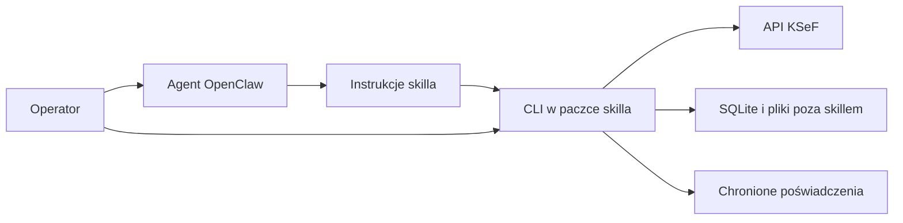

# ACLT-KSeF specyfikacja techniczna

Wersja 0.5. Data 2 października 2026. Status: projekt do przeglądu.

Autor projektu: **Szymon Gałka**.

Kontakt: [kontakt@szymongalka.dev](mailto:kontakt@szymongalka.dev).

Specyfikacja opisuje wykonanie wymagań z [PRD](PRD.md). Priorytetem jest sprawna obsługa wszystkich funkcji przez agenta: krótka instrukcja, spójne operacje i wyniki pozwalające od razu wybrać kolejny krok. Jeden instalowany katalog skilla zawiera własne CLI w Pythonie. OpenClaw uruchamia polecenia, a CLI zachowuje stan operacji i komunikuje się z KSeF. Etapy opisuje [plan](PLAN.md).

## Nazewnictwo i autorstwo

| Element | Wartość |
| --- | --- |
| Nazwa prezentowana użytkownikowi | ACLT-KSeF |
| Autor projektu | Szymon Gałka |
| Kontakt autora | `kontakt@szymongalka.dev` |
| Licencja projektu | GNU GPLv3, SPDX `GPL-3.0-only` |
| Identyfikator skilla i paczki Pythona | `aclt-ksef` |
| Launcher CLI w paczce | `scripts/aclt-ksef` |
| Moduł Pythona | `aclt_ksef` |
| Prefiks zmiennych środowiskowych | `ACLT_KSEF_` |

`README.md` i `SKILL.md` zawierają nazwę produktu, podpis „Autor projektu: Szymon Gałka” oraz adres `kontakt@szymongalka.dev`. Nazwisko w informacjach o autorstwie pozostaje w tej formie, bez odmiany. Metadane `pyproject.toml` wskazują nazwę paczki, autora i adres kontaktowy. `--help` i `--version` przedstawiają ACLT-KSeF oraz podpis „Autor projektu: Szymon Gałka”; pomoc zawiera również kontakt. Tryb maszynowy nie dodaje banera do wyników JSON. `doctor` zwraca nazwę, wersję, autora i kontakt w metadanych instalacji.

Kod i dokumentacja projektu korzystają z GNU GPLv3 (`GPL-3.0-only`). Metadane przyszłej paczki Pythona wskazują ten identyfikator SPDX oraz plik [LICENSE](LICENSE). Pełny tekst licencji jest częścią paczki skilla i archiwów wydań; użyte zależności i zasoby zachowują swoje wymagane oznaczenia.

Podglądy HTML i PDF zawierają dyskretną informację „Wygenerowano przez ACLT-KSeF · Autor projektu: Szymon Gałka · kontakt@szymongalka.dev”. Informacja znajduje się poza danymi sprzedawcy i nabywcy. Branding nie dopisuje pól do faktury FA(3), nie zmienia oryginalnych bajtów XML ani UPO. Przy wykorzystaniu cudzych zależności i zasobów zachowujemy wymagane przez nie informacje o autorach i licencjach.

## Architektura i odpowiedzialności



| Element | Odpowiedzialność |
| --- | --- |
| `SKILL.md` | Rozpoznanie zadania, dobór komendy, zebranie danych, przedstawienie podglądu i wyniku, pozyskanie zgody operatora. |
| CLI | Parsowanie wejścia, walidacja, wykonanie i jednoznaczny wynik dla AI lub człowieka. |
| Moduły Pythona | Operacje API, przechowywanie, dokumenty FA(3), podglądy i reguły stanu. |
| SQLite | Metadane, szkice i wersje, zatwierdzenia, operacje oraz punkty kontynuacji. |
| Pliki danych | Oryginalne XML, podglądy, UPO i zasoby potrzebne do wznowienia operacji. |

Całe działanie biznesowe przechodzi przez te same funkcje niezależnie od wywołania przez agenta lub człowieka. Model nie generuje szyfrogramów, nie oblicza sum i nie ustala statusu przyjęcia na podstawie własnej interpretacji odpowiedzi.

Nie jest potrzebny serwer aplikacyjny. Jedno wywołanie CLI wykonuje ograniczoną pracę, zapisuje stan i kończy proces. Dłuższa operacja może zwrócić identyfikator oraz stan `processing`, który sprawdza następne wywołanie.

## Interfejs dla agenta

Proponowany cel dla `SKILL.md` to do 600 słów. Instrukcja obejmuje uruchomienie CLI, krótką mapę wszystkich kategorii zadań, interpretację wyniku i istotne zasady zgody oraz odzyskiwania. Opisy pól i rozbudowane przypadki są ładowane dopiero dla konkretnej potrzeby. W normalnym przepływie agent nie czyta dokumentacji projektowej ani specyfikacji API.

Komenda `describe` zwraca zwięzły katalog funkcji dostępnych w zainstalowanej wersji. `describe drafts.prepare` lub odpowiedni identyfikator operacji zwraca argumenty, schemat wejścia, ograniczenia i jeden mały przykład. Opis korzysta z tych samych definicji co parser i walidacja. Nie powstaje osobny rejestr narzędzi ani druga, ręcznie utrzymywana wersja kontraktu komend. Odkrywanie nie wymaga profilu ani dostępu do KSeF.

Codzienny przepływ korzysta z komend realizujących zadanie użytkownika:

- `invoices list` odczytuje lokalny zbiór; `--refresh` dodatkowo synchronizuje go przed zastosowaniem filtrów. Jeśli synchronizacja nadal trwa, wynik wskazuje aktualność listy i istniejącą operację.
- `drafts prepare` tworzy lub aktualizuje szkic, generuje XML, waliduje go i przygotowuje podgląd. Zwraca ID, wersję, skrót XML, podsumowanie i ścieżkę podglądu albo zebrane braki danych.
- `corrections prepare` robi to samo dla korekty wskazanego źródła, dodając porównanie zmian.
- `drafts send ID --xml-sha256 SKROT` po zgodzie operatora utrwala zatwierdzenie dokładnej wersji i rozpoczyna kontrolowaną wysyłkę w jednym wywołaniu.
- `operations status ID` sprawdza istniejącą operację i zachowuje UPO, jeśli jest już dostępne.

Komendy szczegółowe służą edycji i rozwiązywaniu problemów. Komendy zadaniowe wywołują wspólne funkcje Pythona, bez uruchamiania innych komend w podprocesach i bez powielania logiki. Każda komenda wymagająca KSeF sama zapewnia dostęp przy użyciu skonfigurowanych poświadczeń; odczyt lokalny nie uruchamia logowania. `doctor` i ręczne `auth login` nie są obowiązkowymi krokami przed każdą czynnością.

Listy domyślnie zwracają do 20 rekordów i pola potrzebne do ich rozpoznania. Szczegóły, XML, podglądy i pełne eksporty pobiera się na żądanie. Importy bibliotek do kryptografii, XML i PDF odbywają się tylko w ścieżkach, które ich potrzebują. Proponowany cel lokalnego odczytu to P95 poniżej jednej sekundy dla strony 20 rekordów w bazie 10 tysięcy faktur, przy rozgrzanym cache systemowym na uzgodnionym serwerze. Pomiar obejmuje start procesu; czas modelu i komunikacji KSeF mierzymy osobno.

## Paczka skilla i instalacja

Proponowany układ docelowy:

```text
aclt-ksef/
  README.md
  LICENSE
  SKILL.md
  pyproject.toml
  uv.lock
  scripts/
    aclt-ksef
    ksef.py
    aclt_ksef/
  references/
    workflows.md
  assets/
    schemas/
  .venv/                 środowisko tworzone podczas instalacji
```

`scripts/aclt-ksef` to mały launcher korzystający wyłącznie z Pythona w `.venv` tej paczki. `scripts/ksef.py` uruchamia CLI, a `scripts/aclt_ksef` zawiera jego moduły. Launcher wyznacza katalog paczki względem własnego położenia, nie względem bieżącego katalogu terminala. Brak środowiska powoduje czytelny błąd instalacji; komenda biznesowa nie pobiera zależności automatycznie.

Repozytorium może dodatkowo zawierać te trzy dokumenty i testy. Archiwum dystrybucyjne zawiera elementy potrzebne do użycia skilla; nie zawiera lokalnej `.venv`, baz, faktur ani poświadczeń. Środowisko powstaje na docelowym Linuxie. CLI nie jest osobnym produktem wymagającym instalacji globalnej.

Propozycja środowiska to Python 3.12 lub nowszy, z wersją testowaną i zapisaną dla wydania. Zależności są przypięte w `uv.lock`; `uv` służy do przygotowania środowiska, a codzienne komendy korzystają bezpośrednio z `.venv`. Jeśli serwer nie ma `uv`, można dostarczyć go lokalnie razem z instalatorem. Nie kopiujemy środowiska z macOS na Linux.

Skill korzysta z wywołań w formie:

```text
"{baseDir}/scripts/aclt-ksef" --json --profile test doctor
"{baseDir}/scripts/aclt-ksef" --json --profile test sync
"{baseDir}/scripts/aclt-ksef" --json --profile test invoices list --direction received
```

OpenClaw udostępnia `{baseDir}` jako odwołanie do folderu skilla. Skill trafia do katalogu odkrywanego przez konkretną instalację OpenClaw; samo wykrycie skilla nie dowodzi dostępu do jego plików i zależności z miejsca wykonywania poleceń. [Format i ładowanie skilli OpenClaw](https://docs.openclaw.ai/tools/skills).

Wdrożenie musi sprawdzić, czy `exec` działa na hoście Gateway, w kontenerze czy na zdalnym węźle. Paczka, Python, dane i poświadczenia muszą być dostępne w tym samym środowisku wykonawczym. Zasady dostępu do skilla i uprawnienia systemowe są osobnymi mechanizmami.

## Zależności

| Narzędzie | Zastosowanie | Moment dodania |
| --- | --- | --- |
| Biblioteka standardowa | `argparse`, `json`, `sqlite3`, `decimal`, `hashlib`, `pathlib`, `tomllib`, `zipfile`, bezpieczne zapisy plików | M1 |
| `httpx` | HTTP, limity czasu i testowalny transport | M1 |
| `cryptography` | Szyfrowanie wymagane przez API i odczyt certyfikatów | M1 |
| `lxml` | XML i walidacja lokalnym XSD | M2 |
| Biblioteka XAdES, wstępnie `signxml` | Podpis procesu logowania certyfikatem | M5 po próbie zgodności |
| `reportlab` i biblioteka QR | PDF i kod weryfikacyjny | M5; HTML dostępny wcześniej |

Dokładne wersje i zgodność bibliotek zostaną ustalone podczas implementacji. Nazwa biblioteki XAdES jest kandydatem, a nie potwierdzeniem interoperacyjności z KSeF. Nie powstaje własna implementacja prymitywów kryptograficznych. SDK MF dla C# i Javy może służyć jako materiał porównawczy; produkt pozostaje w Pythonie. [Biblioteki i przykłady MF](https://ksef.podatki.gov.pl/ksef-na-okres-obligatoryjny/wsparcie-dla-integratorow/).

## Konfiguracja i dane

Operator wskazuje katalog konfiguracji oraz katalog danych. Proponowane wartości domyślne to katalogi XDG użytkownika wykonującego CLI: `~/.config/aclt-ksef` i `~/.local/share/aclt-ksef`. Jawne `ACLT_KSEF_CONFIG_DIR` i `ACLT_KSEF_DATA_DIR` pozwalają dopasować je do Linuxa i kontenera. Zmienne nie zawierają sekretów.

Konfiguracja TOML definiuje profile. Profil ma identyfikator, środowisko `TEST`, `DEMO` lub `PROD`, NIP kontekstu, metodę logowania, odwołania do poświadczeń i role objęte synchronizacją. Dane firmy i zasady numeracji są osobną częścią konfiguracji. Identyfikator profilu jest stabilny; zmiana środowiska lub NIP tworzy nowy profil.

Poświadczenia są wskazywane przez ścieżki do chronionych plików poza paczką skilla. Propozycja pierwszego wdrożenia to uprawnienia `0700` dla katalogu i `0600` dla plików; systemd credentials można wykorzystać, gdy zapewnia je środowisko uruchamiające. Tokeny dostępu i odświeżania również należą do chronionego magazynu, nie do zwykłych tabel faktur. Pierwsza wersja nie wymaga usługi desktopowego keyringu na Linuxie.

Każdy profil ma własny katalog danych i bazę. Rekordy utrwalają również środowisko i NIP jako część kontekstu operacji. Odwołania do XML i UPO są względne wobec katalogu danych profilu. Instalacja i aktualizacja skilla nie zmieniają danych ani sekretów. Usunięcie paczki zachowuje dane; ich osobne usunięcie jest czynnością operatora.

Komendy biznesowe wymagają jawnego `--profile`. Diagnostyka bez profilu może wyłącznie opisać instalację. Utworzenie profilu domyślnie wybiera TEST. PROD wymaga ustawienia dopuszczającego zapis oraz zatwierdzenia dokumentu przypisanego do PROD.

## Kontrakt CLI

Ogólny format:

```text
scripts/aclt-ksef [--json] --profile PROFIL GRUPA KOMENDA [OPCJE]
```

Dane dokumentów trafiają przez `--input PLIK` lub standardowe wejście, nie przez wielowierszowe argumenty powłoki. Agent tworzy ustrukturyzowany JSON i bezpiecznie przekazuje ścieżkę; treści faktur nie są interpolowane do polecenia.

| Komenda | Zachowanie | Etap |
| --- | --- | --- |
| `doctor` | Instalacja, katalogi, konfiguracja, wersje i stan profilu; zdalna kontrola tylko z `--online` | M1 |
| `describe [OPERACJA]` | Katalog dostępnych funkcji lub opis argumentów i wejścia wybranej operacji w JSON | M1; opisy rozbudowywane z funkcjami |
| `profiles list`, `profiles add` | Lista bez sekretów i utworzenie profilu z pliku konfiguracji | M1 |
| `auth login`, `auth status`, `auth logout` | Logowanie, stan i zakończenie lokalnie obsługiwanej sesji | M1 |
| `sync` | Pierwsze pobranie od `--from` lub kontynuacja; wynik podaje rolę, zakres i kompletność | M2 |
| `invoices list`, `invoices show` | Odczyt lokalny; `list` ma limit, stronicowanie, jawne sortowanie i opcjonalne odświeżenie `--refresh` | M2 |
| `invoices fetch` | Pobranie wskazanego numeru KSeF do lokalnego zbioru | M2 |
| `invoices export` | XML, HTML, CSV, później PDF; typ i ścieżka wyniku są jawne | M2 i M5 |
| `drafts create`, `drafts update`, `drafts import-xml` | Nowy szkic lub nowa wersja istniejącego dokumentu | M3 |
| `drafts prepare` | Szkic, XML, walidacja i podgląd w jednym wywołaniu; dla wejścia JSON lub XML | M3 |
| `drafts validate`, `drafts preview` | Walidacja i przygotowanie wersji przeznaczonej do zatwierdzenia | M3 |
| `drafts approve` | Zapis deklaracji zgody dla ID, wersji i `--xml-sha256` w wybranym profilu | M3 |
| `drafts send` | Zatwierdzenie po zgodzie z `--xml-sha256` i jedna kontrolowana próba wysyłki; także użycie wcześniej zapisanego zatwierdzenia | M3 |
| `operations status`, `operations recover`, `operations upo` | Stan wraz z zachowaniem dostępnego UPO, odzyskiwanie i odczyt UPO dla zapisanej operacji | M3 |
| `corrections create` | Szkic korekty związany z zaakceptowaną fakturą źródłową | M4 |
| `corrections prepare` | Szkic korekty z walidacją, porównaniem i podglądem w jednym wywołaniu | M4 |
| `audit list` | Lokalna historia zdarzeń z filtrowaniem | M3 |
| `backup create`, `backup restore` | Spójna kopia i odtworzenie do nowego katalogu | M5 |

Lista komend jest kontraktem planowanego wydania. `--help` opisuje wyłącznie zaimplementowane komendy. Pierwsze `sync` wymaga daty startowej; agent nie wybiera samodzielnie nieograniczonego pobierania całej historii.

W trybie ludzkim CLI wypisuje czytelne tabele i komunikaty po polsku. W trybie `--json` stdout zawiera jeden dokument JSON, również dla błędów parsowania. Logi trafiają do stderr. `--help` i `--version` są udokumentowanymi wyjątkami tekstowymi. `doctor` działa również przy uszkodzonej konfiguracji i nie ujawnia wartości poświadczeń.

Proponowana koperta wyniku:

```json
{
  "schema_version": 1,
  "ok": true,
  "command": "invoices.list",
  "context": {
    "profile": "test",
    "environment": "TEST"
  },
  "data": {
    "items": [],
    "next_cursor": null,
    "last_sync_at": null,
    "completeness": "not_synced"
  },
  "error": null,
  "warnings": [],
  "next_action": null
}
```

Pole `context` po załadowaniu profilu zawiera także NIP. Przy braku możliwości ustalenia kontekstu ma wartość `null`. Kwoty, ilości i kursy są ciągami dziesiętnymi z kropką; `null` oznacza brak informacji. Daty biznesowe mają postać `YYYY-MM-DD`, znaczniki czasu są w ISO 8601 ze strefą. Czasy techniczne przechowujemy w UTC. Model nie otrzymuje pełnych XML domyślnie w wynikach list.

Błąd zawiera `code`, bezpieczny `message`, `retryable`, `retry_after_seconds` i opcjonalne identyfikatory operacji. Informacja o stanie biznesowym pozostaje w `data`. Poprawnie sprawdzona operacja ze stanem `rejected` lub `processing` może mieć `ok: true`; oznacza to udane odczytanie stanu, nie przyjęcie faktury. Niepewne zakończenie polecenia wysyłki ma `ok: false`, kod `SEND_UNCERTAIN` i identyfikator do odzyskiwania.

`next_action` ma wartość `null`, jeśli zadanie zakończono, albo kod z zamkniętego zbioru: `provide_input`, `request_approval`, `check_status`, `recover`, `configure`. Dane uzupełniające znajdują się w wyniku: problemy pól w `error.fields`, kontekst i skrót wymagający zgody w `data`, referencja operacji i zalecany czas kolejnego sprawdzenia. Wszystkie wykryte problemy pól są zwracane razem. To wskazówki strukturalne generowane przez CLI, a nie instrukcje powłoki ani tekst pochodzący z faktury.

| Kod zakończenia | Znaczenie |
| --- | --- |
| 0 | Komenda została wykonana; stan dokumentu opisuje `data`. |
| 2 | Błąd składni lub wejścia polecenia. |
| 3 | Błąd konfiguracji, instalacji lub lokalnego dostępu do danych. |
| 4 | Błąd uwierzytelnienia lub brak uprawnień. |
| 5 | Błąd walidacji dokumentu lub nieobsługiwany wariant. |
| 6 | Błąd komunikacji, limit API lub jednoznaczne odrzucenie żądania HTTP. |
| 7 | Brak właściwego zatwierdzenia albo niedozwolony zapis w PROD. |
| 8 | Niepewny wynik wysyłki wymagający sprawdzenia. |
| 9 | Konflikt stanu lub równoległa operacja. |

Znacząca zmiana semantyki lub usunięcie pola wymaga nowej wersji kontraktu. Dodatkowe pola mogą pojawiać się bez zmiany wersji; skill ignoruje nieznane pola. Limity wyników i eksport do pliku chronią kontekst agenta przed niekontrolowaną ilością danych.

## Integracja z KSeF

Implementacja korzysta z oficjalnego kontraktu właściwego środowiska. Przed kodowaniem zapisujemy identyfikator wersji, źródło i SHA-256 użytego OpenAPI oraz XSD z jego importami. Klient obejmuje potrzebne endpointy; nie generujemy całego systemu z kontraktu API.

### Uwierzytelnianie

M1 realizuje logowanie istniejącym tokenem KSeF: pobranie challenge, zaszyfrowanie wymaganej wartości tokena, rozpoczęcie procesu, sprawdzanie statusu, jednokrotne odebranie tokenów dostępowych oraz ich odświeżanie. Token KSeF nie jest zamiennikiem `accessToken` przekazywanym bezpośrednio do endpointów faktur. Proces odebrania tokenów jest jednorazowy, dlatego również wymaga obsługi niepewnej odpowiedzi. [Proces uwierzytelniania MF](https://github.com/CIRFMF/ksef-api/blob/main/uwierzytelnianie.md).

Logowanie certyfikatem w M5 przygotowuje i podpisuje `AuthTokenRequest` zgodnie z wymaganiami XAdES. Najpierw sprawdzamy zgodność wybranej biblioteki na TEST. Sukces z samopodpisanym certyfikatem nie dowodzi obsługi rzeczywistego certyfikatu i uprawnień DEMO lub PROD. [Wymagania uwierzytelniania MF](https://github.com/CIRFMF/ksef-api/blob/main/uwierzytelnianie.md).

Nie implementujemy w pierwszym wydaniu zarządzania uprawnieniami ani wydawania tokenów i certyfikatów. Operator dostarcza gotowe poświadczenia odpowiedniego środowiska. Wygasłe i unieważnione poświadczenie daje czytelny błąd; CLI nie zastępuje go automatycznie innym profilem.

### Synchronizacja

Synchronizacja wykorzystuje asynchroniczny eksport paczek. Ustalamy role podmiotu objęte pobieraniem i przechowujemy osobny postęp dla każdej roli. Domyślnie są to role sprzedawcy i nabywcy; pozostałe dostępne role dodaje konfiguracja. Wynik raportuje zadeklarowany zakres i jego kompletność, a brak uprawnień do roli nie daje pozornego sukcesu.

Żądanie używa `PermanentStorage` i `restrictToPermanentStorageHwmDate = true`. W zwykłej kontynuacji pomijamy końcowe `to`, korzystając ze stabilnej granicy zwróconej przez KSeF. Dla obciętej paczki następny początek pochodzi z `LastPermanentStorageDate`; dla pełnej z `PermanentStorageHwmDate`. Granice pozostają przyległe, a dokumenty na wspólnej granicy deduplikujemy po numerze KSeF. [Synchronizacja przyrostowa MF](https://github.com/CIRFMF/ksef-api/blob/main/pobieranie-faktur/przyrostowe-pobieranie-faktur.md).

Pobieranie obejmuje sprawdzenie statusu, pobranie i odszyfrowanie części, odtworzenie archiwum oraz przetworzenie XML i metadanych. Pliki są zapisywane atomowo i trwale przed zatwierdzeniem odpowiadających im rekordów. Postęp przesuwa się dopiero po zachowaniu całej przetworzonej paczki. Awaria powoduje ponowne przetworzenie paczki z deduplikacją, nie pominięcie zakresu. Brakujące importy lub niezgodność metadanych blokują zapis nowego punktu kontynuacji.

Referencję trwającego eksportu i materiał potrzebny do jego odczytu przechowujemy tak, by wznowienie nie wymagało ponownego uruchamiania eksportu. Materiał kryptograficzny trafia do chronionej części danych. Osierocone pliki po awarii są wykrywane i rozliczane przy odzyskiwaniu. Brak postępu daty po kolejnej paczce wywołuje diagnostykę zamiast nieskończonej pętli.

### Wysyłka online

Wysyłka otwiera sesję, zapisuje jej referencję, szyfruje zatwierdzony XML, przekazuje fakturę, zachowuje referencję dokumentu i sprawdza jego stan. Sesja zostaje zamknięta; UPO jest pobierane po udostępnieniu. Szyfrowanie API wykorzystuje AES-256-CBC z PKCS#7 i RSA-OAEP z SHA-256 dla klucza sesji, realizowane przez bibliotekę kryptograficzną. [Sesja interaktywna MF](https://github.com/CIRFMF/ksef-api/blob/main/sesja-interaktywna.md).

Wywołania mają ograniczone czasy oczekiwania i zakres pracy. Zakończenie pollingu bez stanu końcowego zwraca zapisany identyfikator operacji. Po utracie odpowiedzi odzyskiwanie korzysta z referencji sesji, referencji faktury, skrótu XML i dostępnych danych KSeF. Jeśli nie można rozstrzygnąć wyniku, stan pozostaje niepewny i wymaga działania operatora. Nie tworzymy obietnicy dokładnie jednokrotnej wysyłki w systemie rozproszonym.

## Dane trwałe

| Zbiór | Najważniejsze dane i ograniczenia |
| --- | --- |
| Faktury | Numer KSeF, numer własny, role, strony, daty, waluta, kwoty, typ, SHA-256 i ścieżka XML; unikalny kontekst i numer KSeF. |
| Szkice i wersje | ID szkicu, numer wersji, wejście, wynik walidacji, niezmienny XML, skrót i artefakty podglądu. |
| Zatwierdzenia | ID i wersja, skrót XML, środowisko, NIP, profil, czas i deklarowany operator. |
| Operacje | Typ, kontekst, stan, referencje KSeF, skróty, bezpieczne szczegóły błędu i znacznik czasu. |
| Kontynuacja synchronizacji | Rola podmiotu, ostatnia trwała granica i odniesienie do trwającego eksportu. |
| Historia zdarzeń | Zmiany wersji i stanu, zatwierdzenia, inicjacja wysyłki, odrzucenia i odzyskiwanie. |

Tabela wiążąca faktury z rolami może reprezentować wiele ról tej samej faktury. Nie należy sprowadzać kierunku dokumentu do jednego pola kosztem utraty ról. Schemat bazy ma jawny numer wersji i sekwencyjne migracje. W M1 wystarczą proste skrypty SQL i `sqlite3`, bez ORM.

Transakcje, ograniczenia unikalności i atomowa zmiana stanu blokują równoległą wysyłkę tej samej wersji. Ta ochrona działa także między dwoma procesami CLI. W ramach jednego profilu dopuszczamy jedną synchronizację jednocześnie; odczyt lokalnych faktur może odbywać się równolegle.

## Dokumenty i obliczenia

Wejście generatora jest wersjonowanym JSON: typ dokumentu, numer, daty, strony, waluta, pozycje, płatność i jawne oznaczenia. Dokładny schemat pól oraz reguły numeracji powstają w M3 na podstawie potwierdzonych przypadków z PRD D02 i D04. Kwoty i ilości są wartościami `Decimal`; float nie uczestniczy w obliczeniach finansowych.

Walidacja ma trzy poziomy: dane wymagane przez obsługiwany przypadek, zgodność XML z lokalnym XSD i kontrole zgodności kwot oraz powiązań dokumentów. Błędy wskazują pola. Reguły zaokrągleń muszą zostać zapisane wraz z przykładami oczekiwanych wyników przed realizacją generatora. Przejście XSD nie jest potwierdzeniem przyjęcia dokumentu przez KSeF ani poprawności kwalifikacji podatkowej.

Podgląd powstaje z utrwalonego XML. Prezentuje wszystkie dane istotne dla zgody, w tym adnotacje i warunki płatności. Niepełny podgląd importowanego wariantu blokuje zatwierdzenie do czasu uzupełnienia prezentacji. Płatność nie jest domyślnie oznaczana jako nieuregulowana, gdy XML nie zawiera takiej informacji.

Szkic i jego podgląd mają oznaczenie robocze. Po przyjęciu dokumentu generowana wizualizacja zawiera numer KSeF i właściwy kod QR oparty na danych oryginalnego XML. Kod zależy od środowiska. PDF obejmuje również polskie znaki i wszystkie pozycje dokumentu. [Kody weryfikujące MF](https://github.com/CIRFMF/ksef-api/blob/main/kody-qr.md).

Korekta jest nowym dokumentem. Zachowuje referencję do źródła, powód, dane zmieniane i wpływ na kwoty. Dokument źródłowy pozostaje niezmienny. Pierwszy generator korekt obejmuje potwierdzone warianty krajowe w PLN; nie zastępujemy pełnego modelu korekty zmianą znaku kwoty.

## Zatwierdzenia i stany

Podstawowy przebieg wersji dokumentu:

```text
draft -> validated -> approved -> sending -> processing -> accepted
                                              |              |
                                              v              v
                                           rejected     UPO pending -> UPO saved

Niepewna komunikacja po rozpoczęciu wysyłki -> uncertain -> recover
```

To model stanów produktu, nie kopia kodów API KSeF. UPO ma osobny stan i może oczekiwać po przyjęciu faktury. `rejected` zachowuje odpowiedź i historię; poprawienie dokumentu tworzy nową wersję. Edycja wersji zatwierdzonej wymaga nowego zatwierdzenia. Wersja rozpoczętej wysyłki jest niezmienna.

Zgoda dotyczy krotki: profil, środowisko, NIP, ID dokumentu, wersja i SHA-256 oryginalnych bajtów XML. Zatwierdzenie i referencja podglądu zostają utrwalone. Przed rozpoczęciem wysyłki CLI ponownie sprawdza skrót, kontekst i stan w jednej transakcji. Zmiana podglądu wynikająca ze zmiany danych także wymaga nowej wersji.

Skill otrzymuje wyraźną zgodę operatora po przedstawieniu podglądu i kontekstu. Może wtedy wykonać `drafts send ID --xml-sha256 SKROT`, które zapisuje zatwierdzenie i rozpoczyna wysyłkę przy użyciu tej samej kontroli stanu. `drafts approve` pozostaje dostępne, gdy zatwierdzenie i wysyłka mają odbyć się oddzielnie. Samo polecenie nie potrafi udowodnić, że zgodę wypowiedział człowiek. To ograniczenie zaufania opisujemy w instrukcji skilla; kontrola skrótu zabezpiecza tożsamość dokumentu, a nie tożsamość rozmówcy. Wymóg osobnego technicznego kanału autoryzacji byłby dodatkowym rozszerzeniem.

Stan `sending` jest trwale zapisywany przed operacją sieciową. Zatwierdzenie nie upoważnia do nieograniczonych kolejnych prób. Wersja `accepted`, `sending`, `processing` lub `uncertain` nie może uruchomić nowej próby wysyłki. Jednoznaczne odrzucenie pozwala wrócić do przygotowania lub ponownego zatwierdzenia; nie uruchamia automatycznej próby.

## Błędy i ograniczenia wykonania

| Sytuacja | Zachowanie |
| --- | --- |
| HTTP 429 | Respektowanie `Retry-After`, zapis postępu; po wyczerpaniu limitu czasu wynik `RATE_LIMITED`. |
| Timeout odczytu lub statusu | Ograniczone ponowienie bez zmiany dokumentu i bez utraty referencji. |
| HTTP 400 wysyłki | Jeśli odpowiedź jednoznacznie odrzuca żądanie, zapis błędu; bez automatycznego ponowienia. |
| Timeout, zerwane połączenie lub niejednoznaczne 5xx po rozpoczęciu wysyłki | `SEND_UNCERTAIN`, zachowanie referencji i kontrolowane odzyskiwanie. |
| HTTP 401 lub 403 | Odnowienie tylko wtedy, gdy semantyka operacji na to pozwala; brak powtórzenia niepewnej wysyłki. |
| Brak pliku, brak miejsca lub uszkodzona baza | Ustrukturyzowany błąd; brak przesunięcia punktu kontynuacji i brak utraty poprzedniego pliku. |
| Uszkodzona paczka lub niespójne metadane | Zachowanie ostatniej dobrej granicy i raport problemu. |
| Równoległa komenda zmieniająca ten sam stan | Konflikt albo użycie istniejącej operacji, bez drugiej wysyłki. |

Powtarzalność jest rozstrzygana per operacja. `POST` nie jest automatycznie powtarzalny; dotyczy to także eksportu, odświeżania i jednokrotnego odebrania tokenów. Mechanizm wspólnych ponowień nie może bezwarunkowo ponawiać każdego błędu sieciowego.

## Granice zaufania

Parser XML nie pobiera zewnętrznych encji, nie wykonuje DTD i nie odwołuje się do sieci podczas walidacji. Rozpakowanie nie pozwala wyjść poza katalog docelowy i ma limit rozmiaru danych. HTML koduje treści faktury i nie uruchamia skryptów pochodzących z XML. CSV neutralizuje pola tekstowe interpretowane przez arkusze jako formuły; kwoty numeryczne zachowują swój sens.

Adresy przekazane przez API są weryfikowane względem dozwolonych hostów właściwego środowiska, ustalonych z aktualnego kontraktu. Nagłówki z tokenami nie są przenoszone do pobierania plików z innego hosta. Logi filtrują sekrety, nagłówki autoryzacji i podpisane adresy pobierania.

Agent z dostępem do powłoki tego samego użytkownika może mieć dostęp do chronionych plików. Instrukcja skilla i uprawnienia `0600` nie tworzą izolacji od tego procesu. Jeśli potrzebna będzie mocniejsza separacja poświadczeń lub zgód, należy osobno zaprojektować uprawnienia procesu i środowiska wykonawczego.

## Testy i odbiór techniczny

Testy obejmują rzeczywiste ryzyka: granice i obcięcie paczek, deduplikację, utrwalenie postępu, kwoty, XSD, tożsamość zatwierdzonego XML, równoległość procesów i niepewne wysyłki. Parser błędów i JSON sprawdzamy także dla błędów argumentów i lokalnych plików. Testy transportu nie łączą się automatycznie z PROD.

Odbiór interfejsu obejmuje nową sesję agenta, która otrzymuje skill, skonfigurowany profil i zadanie użytkownika. Mierzymy poprawność wyboru komendy, liczbę wywołań CLI, potrzebę dodatkowych odczytów instrukcji, rozmiar wyników i czas lokalnej pracy. Dla każdej dostępnej funkcji sprawdzamy ścieżkę odkrycia i poprawność opisu wejścia; rozmowy kontrolne obejmują zadania codzienne oraz reakcję na brak danych i niepewną wysyłkę. Wyniki pokazują też użyty model i konfigurację sesji. Sama poprawność backendu nie zamyka odbioru Q09.

Próby integracyjne są uruchamiane jawnie na TEST z danymi syntetycznymi. DEMO sprawdza rzeczywiste poświadczenia i uprawnienia. Każdy raport wskazuje środowisko, wersję skilla, użyty kontrakt i zakres sprawdzonych operacji. Zaliczone lokalne testy nie zastępują udokumentowanego przebiegu z numerem KSeF i UPO.

Kopia danych korzysta ze spójnego odczytu SQLite i zawiera powiązane XML, UPO oraz manifest skrótów. Tworzenie i odtwarzanie odbywa się przy zablokowanych lokalnych zapisach. Sekrety nie są częścią standardowego archiwum. Odtworzenie zachowuje niepewne operacje i domyślnie blokuje nowe wysyłki. Odblokowanie wymaga synchronizacji okresu od wykonania kopii i rozliczenia wersji, które według kopii mogły zostać wysłane później. Odtworzone zatwierdzenie samo nie wystarcza do ponownej wysyłki.

## Źródła i utrzymanie specyfikacji

Źródła sprawdzono 2 października 2026. Ustalenia produktowe z PRD mają pierwszeństwo przed propozycjami technicznymi. Zmiana API wymaga oceny wpływu na klienta, testy i instrukcję skilla.

Osobny [snapshot acli-ksef/ASEF](materials/acli-ksef/README.md) jest materiałem inspiracyjnym. Zachowuje historyczne nazwy, komendy i opis środowiska źródłowego. Jego instrukcje, konfiguracja, branding i deklaracje walidacji nie określają zachowania ACLT-KSeF. [Analiza adaptacji](materials/acli-ksef/ANALIZA.md) wskazuje rozwiązania do oceny podczas implementacji; normatywnym źródłem integracji pozostają kontrakty MF.

- [Kontrakty i wsparcie integratorów MF](https://ksef.podatki.gov.pl/ksef-na-okres-obligatoryjny/wsparcie-dla-integratorow/).
- [Przewodnik KSeF](https://github.com/CIRFMF/ksef-api).
- [FA(3) i materiały MF](https://ksef.podatki.gov.pl/informacje-ogolne-ksef-20/struktura-logiczna-fa-3/).
- [Bieżące stanowisko MF o certyfikatach i tokenach](https://ksef.podatki.gov.pl/informacje-ogolne-ksef-20/certyfikaty-ksef/).
- [Ładowanie i format skilli OpenClaw](https://docs.openclaw.ai/tools/skills).
- [Miejsce wykonywania poleceń OpenClaw](https://docs.openclaw.ai/tools/exec).

Szczegóły pól wejścia faktury, reguł podatkowych i zaokrągleń oraz konkretna konfiguracja serwera wymagają uzupełnienia w etapach wskazanych w planie. Nie stanowią potwierdzonej implementacji w wersji 0.5 dokumentów.
